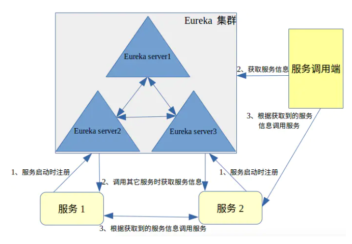

# Eureka 

[Eureka](https://github.com/Netflix/eureka/wiki) 是 Netflix 开发的服务发现框架，本身是一个基于 REST 的服务，主要用于定位运行在 AWS 域中的中间层服务，以达到负载均衡和中间层服务故障转移的目的。后来 SpringCloud 将它集成在其子项目 spring-cloud-netflix 中，以实现 SpringCloud 的服务发现功能。

Eureka 是 SpringCloud 的重要组件，在微服务的架构中充当"服务注册与发现"的中心角色。

Eureka 采用了CS的设计架构，Eureka Server 作为服务注册功能的服务器，是服务注册中心。而系统中的其他微服务，使用 Eureka 的客户端（Client）连接到 Eureka Server 并维持心跳连接。

## Eureka 系统架构

eureka如何管理服务调用的？我们先来看个图：

Eureka 运作流程大致是这样的：

1. 在 Eureka Client 启动的时候，将自身的服务的信息发送到 Eureka Server。然后进行2调用当前服务器节点中的其他服务信息，保存到 Eureka Client 中。当服务间相互调用其它服务时，在 Eureka Client 中获取服务信息（如服务地址，端口等）后，进行第3步，根据信息直接调用服务。（注：服务的调用通过http(s)调用）

2. 当某个服务仅需要调用其他服务，自身不提供服务调用时。在 Eureka Client 启动后会拉取 Eureka Server 的其他服务信息，需要调用时，在 Eureka Client 的本地缓存中获取信息，调用服务。

3. Eureka Client 通过向 Eureka Server 发送心跳（默认每30秒）来续约服务的。 如果客户端持续不能续约，那么，它将在大约90秒内从服务器注册表中删除。 注册信息和续订被复制到集群中的 Eureka Server 所有节点。 以此来确保当前服务还“活着”，可以被调用。

4. 来自任何区域的 Eureka Client 都可以查找注册表信息（每30秒发生一次），以此来确保调用到的服务是“活的”。并且当某个服务被更新或者新加进来，也可以调用到新的服务。

[官网 Wiki - Eureka at a glance](https://github.com/Netflix/eureka/wiki/Eureka-at-a-glance)也提供了一套高可用的部署图：

更详细了解 Eureka，可以查阅[Github Wiki - Netflix/eureka](https://github.com/Netflix/eureka/wiki)、

## 使用手册

参考[spring cloud 配置教程](https://blog.csdn.net/forezp/article/details/69696915)

Eureka server 是有界面的，配置后可以通过访问页面查看服务注册情况：

上图可以看出，有两个服务`APOLLO-ADMINSERVICE`、`APOLLO-CONFIGSERVICE`已经在 Eureka 上注册好了，并且状态是正常的；

