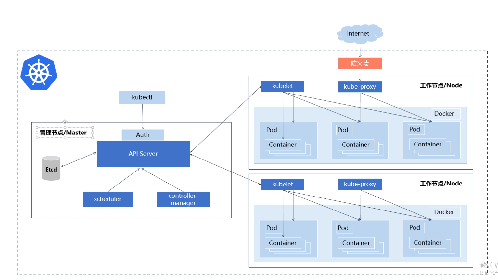
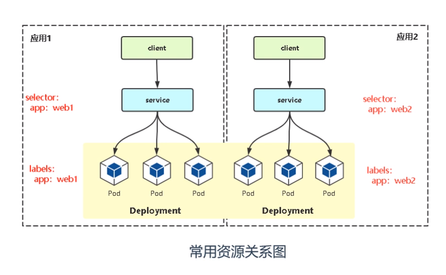

# Kubernetes 

Kubernetes 这个名字源于希腊语，意为“舵手”或“飞行员”。k8s 这个缩写是因为 k 和 s 之间有八个字符的关系

Kubernetes 是用于自动部署，扩展和管理容器化应用程序的开源系统。它将组成应用程序的容器组合成逻辑单元，以便于管理和服务发现。

## 学习资料

- [Kubernetes官网文档](https://kubernetes.io/zh/docs/home/)
- [腾讯课堂 - Kubernetes/K8s 从入门到实战教程](https://ke.qq.com/course/2368264/8879200641753864)

## Kubernetes集群架构与组件



- 管理节点/Master：对集群做出全局决策(比如调度)，以及检测和响应集群事件

| 组件 | 说明 |
| --- | --- |
| kube-apiserver(API Server) | Kubernetes API，是集群统一入口，各个组件的协调者。以 RESTful API 提供接口服务，所有对象的增删查改和监听操作都交由APIServer来处理后再提交给etcd存储 |
| etcd | 分布式键值存储系统。用于保存集群状态数据，比如Pod、Service等对象信息 |
| kube-scheduler | 根据调度算法为新创建的Pod选择一个Node节点，可以任意部署（可以部署到同一个节点或者不同节点上）|
| kube-controller-manager | 处理集群中常规后台任务，一个资源对应一个控制器，而controller-manager就是负责管理这些控制器（包括节点控制器、任务控制器、端点控制器、服务帐户和令牌控制器） |
| cloud-controller-manager | 云控制器管理器是指嵌入特定云的控制逻辑的 控制平面组件。 云控制器管理器使得你可以将你的集群连接到云提供商的 API 之上， 并将与该云平台交互的组件同与你的集群交互的组件分离开来 |

- 工作节点/Node：节点组件在每个节点上运行，维护运行的 Pod 并提供 Kubernetes 运行环境

| 组件 | 说明 |
| --- | --- |
| kubelet | kubelet是Master在Node节点上的Agent，管理本机运行容器的声生命周期，比如创建容器、Pod挂载数据卷、下载secret、获取容器和节点状态等工作。kubelet将每个Pod转换成一组容器 |
| kube-proxy | 在Node节点上实现Pod网络代理，维护网络规则和四层负载均衡工作 |
| 第三方容器引擎（容器运行时） | 容器运行环境是负责运行容器的软件。Kubernetes 支持容器运行时，例如 Docker、 containerd、CRI-O 以及 Kubernetes CRI (容器运行环境接口) 的其他任何实现。 |


## Kubernetes基本资源概念



| 资源概念 | 说明 |
| --- | --- |
| Pod | Kubernetes最小部署单元，一组容器的集合 |
| Deployment | 最常用的控制器，用于更高级别的部署和管理Pod |
| Service | 为一组Pod提供负载均衡，对外提供统一的访问API |
| Label标签 | 附加到某个资源上，用于关联资源、查询和筛选 |
| namespace 命名空间 | 将资源对象逻辑上隔离，从而形成多个虚拟集群，也利于权限控制 |

**详细介绍**

- Pod

Pod是一个逻辑抽象概念，Kubernetes创建和管理的最小单元，一个Pod由一个容器或者多个容器组成。

``` 
Pod运行多个容器，可以共享网络和共享存储
* 共享存储：容器之间通过数据卷共享数据；
* 共享网络：在创建Pod前先创建infra controller，其负责网络管理，而自定义的容器都会加入到这个网络当中；
```

- Deployment

Deployment是最常用的k8s工作负载控制器（workload controller），是一个抽象概念，用于更高级层次对象，部署和管理Pod

- service

service引入主要解决Pod动态变化，提供统一的访问入口：
1. 防止Pod失联，准备找到提供同一个服务的Pod（服务发现）；
2. 定义一组Pod的访问策略（负载均衡）；


