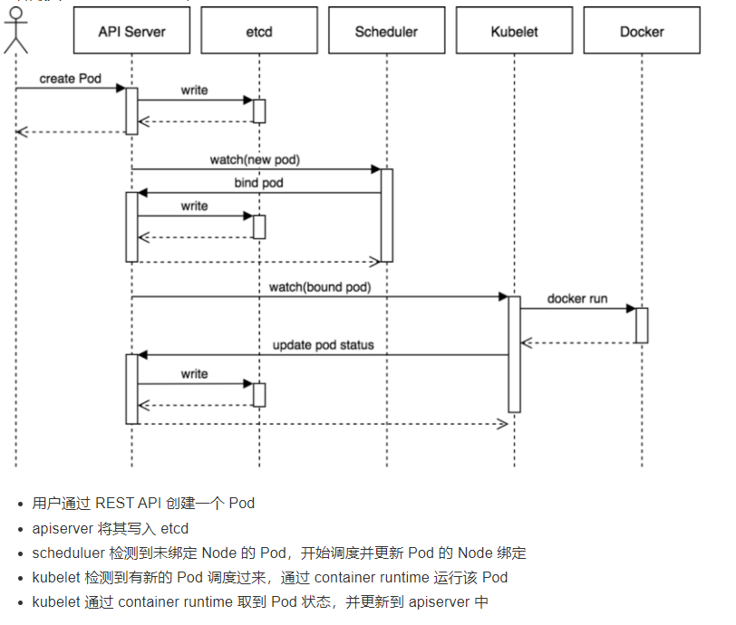
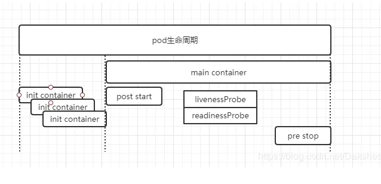
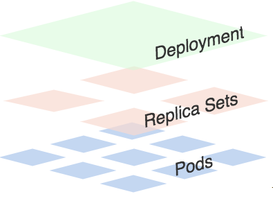
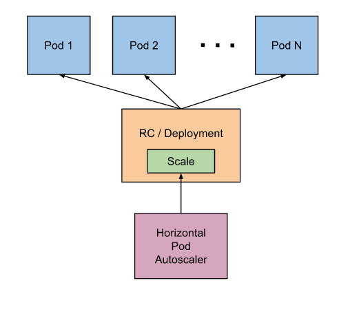

# Kubernetes 

Kubernetes 这个名字源于希腊语，意为“舵手”或“飞行员”。k8s 这个缩写是因为 k 和 s 之间有八个字符的关系

Kubernetes 是用于自动部署，扩展和管理容器化应用程序的开源系统。它将组成应用程序的容器组合成逻辑单元，以便于管理和服务发现。

## 学习资料

- [Kubernetes官网文档](https://kubernetes.io/zh/docs/home/)
- [腾讯课堂 - Kubernetes/K8s 从入门到实战教程](https://ke.qq.com/course/2368264/8879200641753864)

## Kubernetes集群架构与组件




### 管理节点/Master

Master 节点是 Kubernetes 集群的控制节点，负责整个集群的管理和控制。Master 节点上包含以下组件：

| 组件 | 说明 |
| --- | --- |
| kube-apiserver(API Server) | Kubernetes API，是集群统一入口，各个组件的协调者。以 RESTful API 提供接口服务，所有对象的增删查改和监听操作都交由APIServer来处理后再提交给etcd存储 |
| etcd | 分布式键值存储系统。用于保存集群状态数据，比如Pod、Service等对象信息 |
| kube-scheduler | 负责 Pod 的调度 |
| kube-controller-manager | Kubernetes 集群中所有资源对象的自动化控制中心。controller-manager就是负责管理这些控制器（包括节点控制器、任务控制器、端点控制器、服务帐户和令牌控制器） |
| cloud-controller-manager | 云控制器管理器是指嵌入特定云的控制逻辑的 控制平面组件。 云控制器管理器使得你可以将你的集群连接到云提供商的 API 之上， 并将与该云平台交互的组件同与你的集群交互的组件分离开来 |

### 工作节点/Node

Node 节点是 Kubernetes 集群中的工作节点，Node 上的工作负载由 Master 节点分配，工作负载主要是运行容器应用。Node 节点上包含以下组件：

| 组件 | 说明 |
| --- | --- |
| kubelet | kubelet是Master在Node节点上的Agent，负责 Pod 的创建、启动、监控、重启、销毁等工作，同时与 Master 节点协作，实现集群管理的基本功能 |
| kube-proxy | 实现 Kubernetes Service 的通信和负载均衡 |
| 第三方容器引擎（容器运行时） | 容器运行环境是负责运行容器的软件。Kubernetes 支持容器运行时，例如 Docker、 containerd、CRI-O 以及 Kubernetes CRI (容器运行环境接口) 的其他任何实现。 |


## Kubernetes基本资源概念


| 资源概念 | 说明 |
| --- | --- |
| Pod | Pod 是 Kubernetes 最基本的部署调度单元。每个 Pod 可以由一个或多个业务容器和一个根容器(Pause 容器)组成。一个 Pod 表示某个应用的一个实例 |
| ReplicaSet | 是 Pod 副本的抽象，用于解决 Pod 的扩容和伸缩 |
| Deployment | Deployment 表示部署，在内部使用ReplicaSet 来实现。可以通过 Deployment 来生成相应的 ReplicaSet 完成 Pod 副本的创建 |
| Service | Service 是 Kubernetes 最重要的资源对象。Kubernetes 中的 Service 对象可以对应微服务架构中的微服务。Service 定义了服务的访问入口，服务的调用者通过这个地址访问 Service 后端的 Pod 副本实例。Service 通过 Label Selector 同后端的 Pod 副本建立关系，Deployment 保证后端Pod 副本的数量，也就是保证服务的伸缩性。 |
| Label标签 | 附加到某个资源上，用于关联资源、查询和筛选 |
| namespace 命名空间 | 将资源对象逻辑上隔离，从而形成多个虚拟集群，也利于权限控制 |

下面是详细介绍：

### Pod与静态Pod

Pod是一个逻辑抽象概念，Kubernetes创建和管理的最小单元，一个Pod由一个容器或者多个容器组成。

``` 
Pod运行多个容器，可以共享网络和共享存储
* 共享存储：容器之间通过数据卷共享数据；
* 共享网络：在创建Pod前先创建infra controller，其负责网络管理，而自定义的容器都会加入到这个网络当中；
```

- 静态Pod

在Kubernetes集群中除了我们经常使用到的普通的 Pod 外，还有一种特殊的 Pod，叫做Static Pod。

静态 Pod 直接由特定节点上的kubelet进程来管理，不通过 master 节点上的apiserver。无法与我们常用的控制器Deployment或者DaemonSet进行关联，它由kubelet进程自己来监控，当pod崩溃时重启该pod，kubelete也无法对他们进行健康检查。静态 pod 始终绑定在某一个kubelet，并且始终运行在同一个节点上。 kubelet会自动为每一个静态 pod 在 Kubernetes 的 apiserver 上创建一个镜像 Pod（Mirror Pod），因此我们可以在 apiserver 中查询到该 pod，但是不能通过 apiserver 进行控制（例如不能删除）。
``` 
创建静态 Pod 有两种方式：配置文件和 HTTP 两种方式:

1. 配置文件就是放在特定目录下的标准的 JSON 或 YAML 格式的 pod 定义文件。用kubelet --pod-manifest-path=<the directory>来启动kubelet进程，kubelet 定期的去扫描这个目录，根据这个目录下出现或消失的 YAML/JSON 文件来创建或删除静态 pod。

2. kubelet 周期地从–manifest-url=参数指定的地址下载文件，并且把它翻译成 JSON/YAML 格式的 pod 定义。
```

- Pod的生命周期



``` 
1. Init Container: 用来做初始化工作的容器，可以是一个或者多个，如果有多个的话，这些容器会按定义的顺序依次执行，只有所有的Init Container执行完后，主容器才会被启动;

2. PostStart：这个钩子在容器创建后立即执行。但是，并不能保证钩子将在容器ENTRYPOINT之前运行，因为没有参数传递给处理程序。主要用于资源部署、环境准备等。不过需要注意的是如果钩子花费太长时间以至于不能运行或者挂起， 容器将不能达到running状态。

3. liveness probe（存活探针）

kubelet 通过使用 liveness probe 来确定你的应用程序是否正在运行，通俗点将就是是否还活着。一般来说，如果你的程序一旦崩溃了， Kubernetes 就会立刻知道这个程序已经终止了，然后就会重启这个程序。而我们的 liveness probe 的目的就是来捕获到当前应用程序还没有终止，还没有崩溃，如果出现了这些情况，那么就重启处于该状态下的容器，使应用程序在存在 bug 的情况下依然能够继续运行下去。

4. readiness probe（可读性探针）

kubelet 使用 readiness probe 来确定容器是否已经就绪可以接收流量过来了。这个探针通俗点讲就是说是否准备好了，现在可以开始工作了。只有当 Pod 中的容器都处于就绪状态的时候 kubelet 才会认定该 Pod 处于就绪状态，因为一个 Pod 下面可能会有多个容器。当然 Pod 如果处于非就绪状态，那么我们就会将他从我们的工作队列(实际上就是我们后面需要重点学习的 Service)中移除出来，这样我们的流量就不会被路由到这个 Pod 里面来了。

5. PreStop：这个钩子在容器终止之前立即被调用。它是阻塞的，意味着它是同步的， 所以它必须在删除容器的调用发出之前完成。主要用于优雅关闭应用程序、通知其他系统等。如果钩子在执行期间挂起， Pod阶段将停留在running状态并且永不会达到failed状态。
```

### ReplicationController(RC) 与 Replication Set(RS)

Replication Controller：用来部署、升级Pod；Replica Set：下一代的Replication Controller

总结下关于RC/RS的一些特性和作用：
- 大部分情况下，我们可以通过定义一个RC实现的Pod的创建和副本数量的控制
- RC中包含一个完整的Pod定义模块（不包含apiversion和kind）
- RC是通过label selector机制来实现对Pod副本的控制的
- 通过改变RC里面的Pod副本数量，可以实现Pod的扩缩容功能
- 通过改变RC里面的Pod模板中镜像版本，可以实现Pod的滚动升级功能（但是不支持一键回滚，需要用相同的方法去修改镜像地址）

### Deployment

Deployment是最常用的k8s工作负载控制器（workload controller），是一个抽象概念，用于更高级层次对象，部署和管理Pod

其主要特性包括：
- RC的全部功能：Deployment具备上面描述的RC的全部功能
- 事件和状态查看：可以查看Deployment的升级详细进度和状态
- 回滚：当升级Pod的时候如果出现问题，可以使用回滚操作回滚到之前的任一版本
- 版本记录：每一次对Deployment的操作，都能够保存下来，这也是保证可以回滚到任一版本的基础
- 暂停和启动：对于每一次升级都能够随时暂停和启动

------------------



一个Deployment拥有多个Replica Set，而一个Replica Set拥有一个或多个Pod。一个Deployment控制多个rs主要是为了支持回滚机制，每当Deployment操作时，Kubernetes会重新生成一个Replica Set并保留，以后有需要的话就可以回滚至之前的状态。

------------------

### Pod水平自动伸缩（Horizontal Pod Autoscaling，简称：HPA）


HAP通过监控分析RC或者Deployment控制的所有Pod的负载变化情况来确定是否需要调整Pod的副本数量；

### Job与Cronjob

Job负责处理任务，即仅执行一次的任务，它保证批处理任务的一个或多个Pod成功结束。而CronJob则就是在Job上加上了时间调度

### ConfigMap与Secret

对比下Secret和ConfigMap这两种资源对象的异同点：

相同点：
- 属于某个特定的namespace
- 可以导出到环境变量
- 可以通过目录/文件形式挂载
- 通过 volume 挂载的配置信息均可热更新

不同点：
- Secret 可以被 ServerAccount 关联
- Secret 可以存储 docker register 的鉴权信息，用在 ImagePullSecret 参数中，用于拉取私有仓库的镜像
- Secret 支持 Base64 加密
- Secret 分为 kubernetes.io/service-account-token、kubernetes.io/dockerconfigjson、Opaque 三种类型，而 Configmap 不区分类型

### service

Service是一种抽象的对象，它定义了一组Pod的逻辑集合和一个用于访问它们的策略


