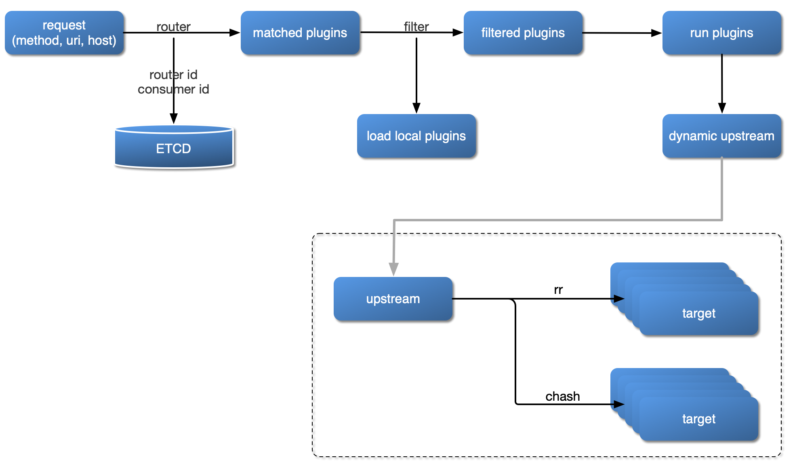
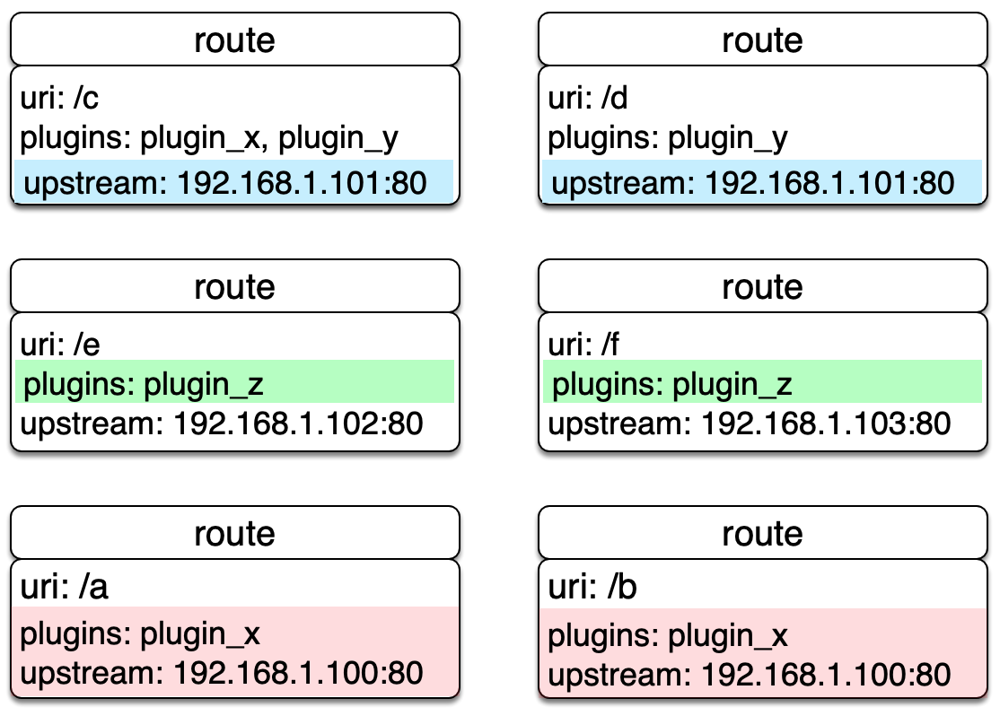
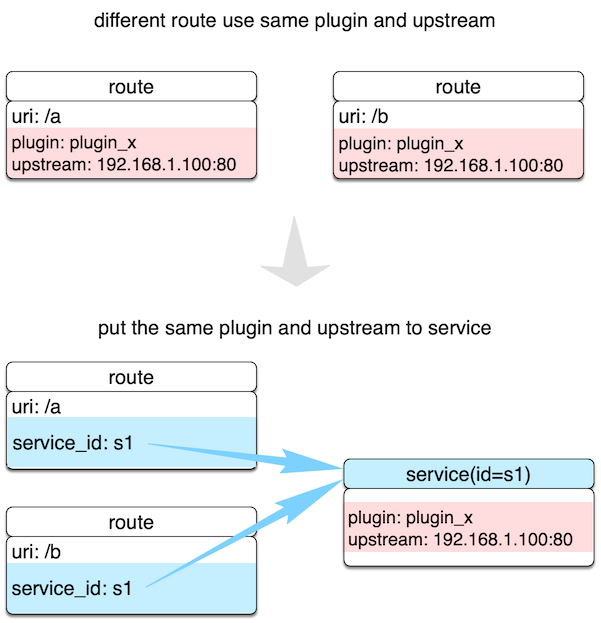

# Apache APISIX

Apache APISIX是一个动态、实时、高性能的API网关。提供了丰富的流量管理功能，如负载均衡、动态上游、canary释放、断路、认证、可观察性等

官方文档：https://apisix.apache.org/zh/docs/apisix/getting-started/

## 软件架构

## 插件加载流程

## 基本概念

| 基本概念 | 概念描述 |
| --- | --- |
| Router 路由 | Route 中主要包含三部分内容：匹配规则（比如 uri、host、remote_addr 等），插件配置（限流限速等）和上游信息。路由通过定义一些规则来匹配客户端的请求，然后根据匹配结果加载并执行相应的插件，并把请求转发给到指定 Upstream。 |
| Plugin 插件 | Plugin表示将在HTTP请求/响应生命周期期间执行的插件配置。Plugin配置可直接绑定在Route上，也可以被绑定在Service或Consumer上。而对于同一个插件的配置，只能有一份是有效的，配置选择优先级总是 Consumer > Route > Service。 |
| Script 脚本 | Script表示将在HTTP请求/响应生命周期期间执行的脚本；Script配置可直接绑定在Route上。 **注意**：Script与Plugin互斥，且优先执行Script ，这意味着配置Script后，Route上配置的Plugin将不被执行。 |
| Service 服务 | Service是某类API的抽象（也可以理解为一组Route的抽象）。它通常与上游服务抽象是一一对应的，Route与Service之间，通常是 N:1 的关系，参看下图。 |
| Upstream 虚拟主机抽象 | Upstream对给定的多个服务节点按照配置规则进行负载均衡。Upstream的地址信息可以直接配置到Route（或Service) 上，当 Upstream有重复时，就需要用“引用”方式避免重复了。 |

