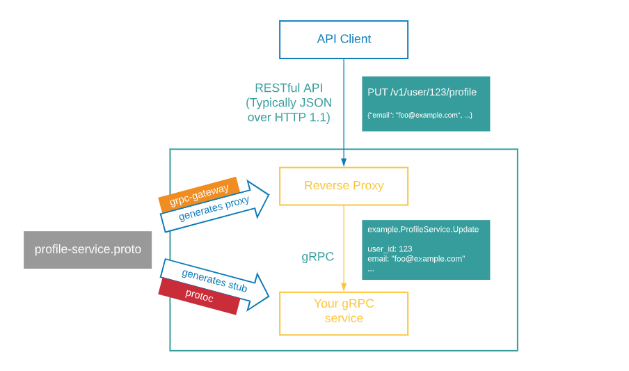

## 命令 protoc-gen-grpc-gateway

gRPC-Gateway 是 protoc 的一个插件。它能读取 gRPC服务的定义信息并生成反向代理的服务器（根据 RESTful API的http请求来转发为 gRPC协议，如下图）。

----------------

- [gRPC-Gateway 英文文档](https://grpc-ecosystem.github.io/grpc-gateway/)

----------------
gRPC-Gateway is a plugin of protoc. It reads a gRPC service definition and generates a reverse-proxy server which translates a RESTful JSON API into gRPC. This server is generated according to custom options in your gRPC definition.